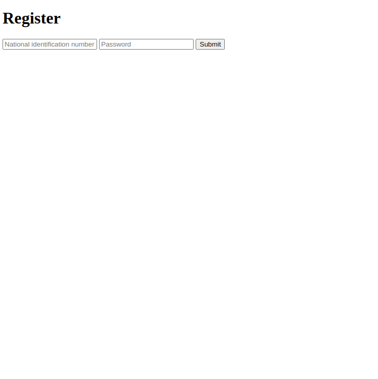

# About 💬

The purpose of this repository is to serve as a template or demo for a generic financials application, that allows for visualization of and interaction with bank accounts (cards and payments may be supported in the future).

## Structure 🏢

- 🏦 `bank-integration-service` is a Python Flask/AlchemySQL web server that interacts with bank PSD2 APIs. It requires at least registered apps in said banks' sandbox environments. Currently only connected to the Swedish SEB bank.
- 🚢 `infrastructure` contains a Docker based means of spinning up the back-end for project, including a PostgreSQL database.
- 📃 `financial-information-service` is a NestJS/Prisma back-end, towards which a front-end app would make calls for fetching information. This back-end in turn relies on the `bank-integration-service` for interfacing with the actual bank PSD2 apis. The purpose of this back-end service is only to manage the users of your app and their information. Uses pnpm as the package manager.
- `user-facing-application` is a Svelte app for registering, logging in, connecting to a bank and visualising one's financial data. Uses npm as its package manager.


## Running 🔌

If for the first time, you have to do some prep in `infrastructure`:

0. Prep the docker-compoes yml file with your SEB client id & secret.
1. Start only `database` by running `docker compose up database`.
2. Run the database setup script `./scripts/setup_database.sh`, then `docker compose down database`.
3. In a separate terminal window/tab, run `docker compose up database bank-integration-service`, which will populate it's database (`financial`) with the required tables and spin the service up.
4. Run `docker compose up database financial-information-service`, which will do the same, but for the service that handles users & all features that they have access to.
5. `docker compose down`

After the first time.
In `infrastructure`:

1. `docker compose up`

In `user-facing-application`:

1. `npm install` to install dependencies.
2. `npm run dev` to start the application in development mode.

## Interacting / Demoing

1. Navigate to the Svelte app's `/register` endpoint.
2. Put in the SEB test person's national identification number `199311219639` & write a test password, e.g `test_password`.
3. After registering, navigate to the `/login` page and provide the number & password as input.
4. Navigate to `/connect`.
5. Have Postman prepared, as you will be using SEB's mock BankID signature to authorize the back-end. The URL for this at the time of me writing this is `https://api-sandbox.sebgroup.com/open/sb/auth/mock/v1/login`. You will shortly hit it with the following payload.

```
{
    "personal_identity_number": "199311219639",
    "start_token": "START_TOKEN"
}
```

6. Open your browser's developer tools and navigate to the network tab. Click on "start" and watch for the `init_auth` request reply. From it, you will copy the `bank_id_autostart_token` value and use it in the request above to mock a BankID auth :). You have 30 or so seconds to do so.
7. Navigate to `/overview`, wait for ~20 seconds and refresh the page, then click "load overview". In the future there will be a loader UI element and the loading will happen automatically, but there's barebones HTML and CSS at the moment.
8. Done, you should see some simple tables with the SEB demo accounts data.

Right now the support for refreshing an access token to SEB exists, but it's not being taken advantage of. The current testing flow is to wipe the db before running the flow end-to-end. In the future using the refresh token should be supported, so you can just fetch financial information without needing to authorize the back-end.




## TO-DO 👷‍♂️

- In `bank-integration-service`
  - Add logger / error monitoring
  - Add error handling - timeouts, connectivity, bad requests
  - Tests with pytest
- In `financial-information-service`
  - Add logger / error monitoring
  - Switch login to use internal user id instead of national identification number (for security purposes).
  - Extend the models to support common fields such as `created_at` upon row insertion and `update_at` upon row updates. E.g -> https://x-team.com/blog/automatic-timestamps-with-postgresql/
  - Rate limiting and customer error messages to avoid software fingerprinting
  - Tests with Jest.
- In `user-facing-application`:
  - Update the front-end application to be more eye-pleasing. The current condition is just a proof-of-concept.
  - Dockerize the front-end application.
